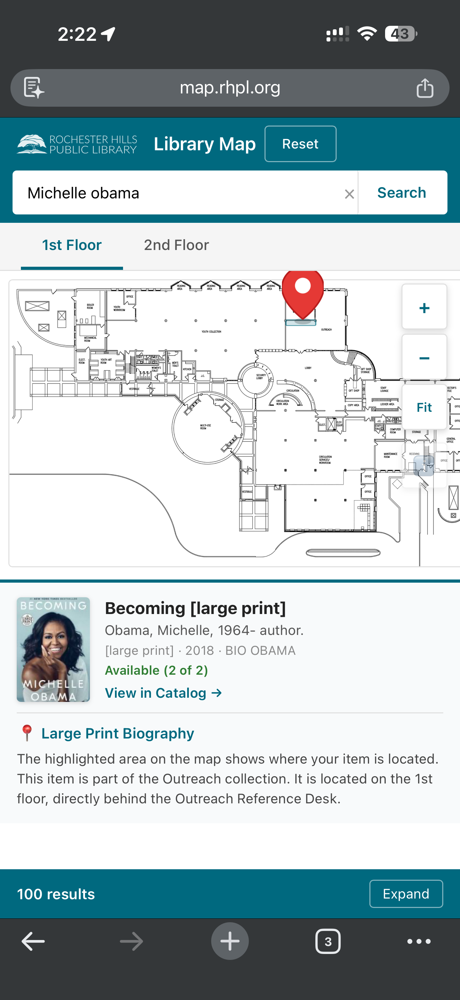
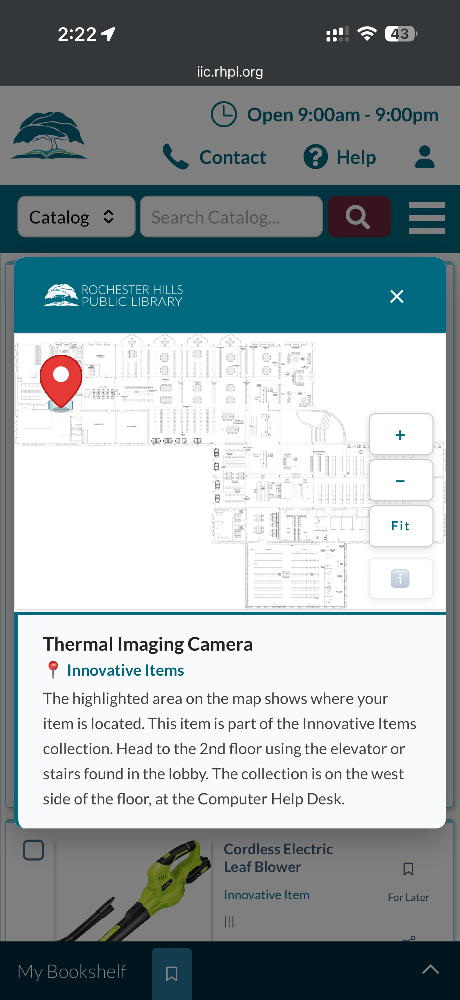

# FindIt

Open-source shelf-mapping for [Vega Discover](https://www.iii.com/products/vega/) library catalogs. Shows patrons exactly where an item is physically located using an interactive floor map — no paid subscription required.

**Hackathon Presentation (IUG 2026):** [View on Google Slides](https://docs.google.com/presentation/d/1mpRiihuq2_tfgYei5wZ-TRuKQkVyce_wi8BQwHU4XKM/edit?usp=sharing) | [Download PPTX](docs/FindIt_Hackathon_IUG_2026.pptx)

---

> **This repository is a project template, not a deployment source.**
> Clone or fork it, customize the config for your library, and deploy
> the files to **your own web server** via SFTP or your preferred method.
> Never link your catalog directly to files hosted on GitHub.

---

## What It Does

When a patron views an item in your Vega Discover catalog, FindIt adds a **"View Shelf Location"** button alongside the existing action buttons (Place Hold, Find Specific Edition). Clicking the button opens a modal overlay with:

- A teal header bar showing the collection/location name
- The library's floor map with the item's shelf location highlighted
- Zoom in, zoom out, and fit-to-view controls
- Click-and-drag panning when zoomed in
- Close via the X button, clicking outside the modal, or pressing Escape
- **Multi-branch support**: for items available at multiple branches or floors, tabs let patrons switch between locations — only showing branches where the item actually exists

The button integrates seamlessly with Vega's existing UI — matching the style and placement of native action buttons.

### Mobile Experience

FindIt is designed mobile-first. Both the standalone map app and the Vega catalog integration are fully responsive and optimized for touch.

**Standalone Map App** (`map.rhpl.org`) — Patrons search the catalog, tap a result, and see the item's shelf location highlighted on the floor plan with a Google Maps-style pin. The info card below the map shows the book cover (via Syndetics), title, author, availability, a link to the full catalog record, and walking directions to the shelf.



**Vega Catalog Integration** (`iic.rhpl.org`) — When browsing items in the Vega Discover catalog, patrons tap "View Shelf Location" to open an interactive map modal. The modal includes the RHPL logo, floor plan with highlighted shelf area and pin marker, landmark icons (restrooms, elevator, reference desks), zoom controls with a landmark toggle, and a directions panel with the item name, collection, and step-by-step wayfinding text.



Both views support pinch-to-zoom, native scrolling in all directions, and work on phones, tablets, and Google Chrome OS kiosks.

---

## How It Works

FindIt is a single JavaScript file that:

1. **Scans** the Vega DOM for availability information using `data-automation-id` attributes (`item-availability-message`, `item-call-number-and-location`)
2. **Matches** the item's collection, location, call number, or Dewey range against a library-defined configuration
3. **Injects** a "View Shelf Location" button into the action area (next to Place Hold)
4. **Opens** an interactive map modal when the button is clicked

No server-side component. No recurring cost. No external API calls. Pure vanilla JavaScript.

---

## Security: Self-Host Your Files

FindIt is designed so that each library hosts its own copy of the script and map images on infrastructure they control. This is intentional:

- **Map images** contain your library's floor plans — host them on your own server, uploaded via SFTP
- **Config files** contain URLs pointing to your server — keep them on your server, not on GitHub
- **The bundled JS file** runs in your patrons' browsers — serve it from your own domain

**Do not** load scripts or images directly from this GitHub repository into your catalog. If you do, anyone with push access to the repo could change what your patrons see. Always deploy to your own server first.

---

## Get Started

### What You Need

- **Polaris ILS** with PAPI (REST API) access — ask your Polaris admin for an AccessID and Secret Key
- **Vega Discover** catalog with Custom Header Code access
- **Floor plan images** of your building (JPEG or PNG, any resolution)
- **A place to host files** — Docker, any web server, or free static hosting

### Step 1: Get your floor plan images

You need architectural floor plans or clear photographs of each floor. Tips:
- JPEG for photographs/scans, PNG for digital drawings
- 1200-3000px wide recommended (zoom controls handle the rest)
- Clean unmarked images work best — FindIt adds the highlights dynamically

### Step 2: Choose your deployment path

#### Path A: Docker (full experience, 10 minutes)

Best for libraries that want the visual editor, catalog search, and Vega widget.

```bash
git clone https://github.com/RHPubLib/FindIt.git
cd FindIt
```

1. Add your floor plan images to `maps/`
2. Edit `docker-compose.yml` — fill in your Polaris PAPI credentials, Vega URL, and library name
3. Copy `data/ranges.example.json` to `data/ranges.json` and edit it with your shelf locations (or use the visual editor once it's running)
4. Start it: `docker-compose up -d`
5. Visit `http://localhost:8080/map` to see your map

See the full [Docker Deployment Guide](docs/deployment/docker.md) for details and all configuration options.

#### Path B: Static Hosting (map + widget only, free, 5 minutes)

Best for libraries that want the interactive map and Vega integration without running a server. Works with GitHub Pages, Cloudflare Pages, or Netlify.

1. Fork this repository on GitHub
2. Edit `map-app/js/map-config.js` with your floor plan URLs
3. Create `data/ranges.json` with your shelf locations (see `data/ranges.example.json` for the format)
4. Enable GitHub Pages in your repo settings
5. Your map is live at `https://yourusername.github.io/FindIt/map-app/`

See the full [Static Hosting Guide](docs/deployment/static-hosting.md) for details.

#### Path C: Any Web Server (SFTP, Apache, Nginx, IIS)

Upload these files to any web server:

```
your-server.com/
├── map/                    ← contents of map-app/ directory
├── data/
│   └── ranges.json         ← your shelf locations
├── maps/
│   ├── floor1.jpg
│   └── floor2.jpg
├── widget.js               ← copy of libraries/rhpl/findit-rhpl.js
└── .htaccess               ← copy from .htaccess.example (Apache only)
```

### Step 3: Define your shelf locations

Create a `ranges.json` file that maps collections to locations on your floor plan. Each entry needs:

```json
{
  "collection": "Adult Fiction",
  "label": "Adult Fiction - 1st Floor",
  "directions": "Located on the 1st floor in the main reading area.",
  "map": "/maps/floor1.jpg",
  "x": 60.0,
  "y": 40.0,
  "area": { "x": 50, "y": 35, "width": 20, "height": 10, "color": "#00697f" }
}
```

Coordinates are percentages (0-100) of the image. To find them:
1. Open your floor plan in any image editor
2. Note the pixel position of the shelf area
3. Convert: `percentage = (pixel / image_dimension) * 100`

Or use the **visual editor** (Docker path) — draw rectangles directly on the floor plan with your mouse.

See `data/ranges.example.json` for a complete example with landmarks.

### Step 4: Add FindIt to your Vega catalog

Add this as the **very first line** of your Vega Discover Custom Header Code:

```html
<script src="https://findit.yourlibrary.org/widget.js"></script>
```

Replace the URL with wherever you're hosting the widget file.

**Important:** The `<script>` tag must be the first line — Vega strips script tags that appear after HTML content.

That's it. Patrons will see a **"View Shelf Location"** button on every item that matches a collection in your `ranges.json`.

---

## Configuration

The bundled JS file includes a `FindItConfig` object:

```js
window.FindItConfig = {
  libraryName: "Your Library",
  buttonLabel: "View Shelf Location",
  defaultMap: "https://your-server.com/maps/floor1-marked.jpg",
  ranges: [
    {
      collection: "Innovative Items",
      label: "Innovative Items Collection - 2nd Floor",
      map: "https://your-server.com/maps/floor1-iic-marked.jpg"
    }
  ]
};
```

### Matching Rules

Each range entry uses one matcher:

| Matcher | Example | Description |
|---|---|---|
| `collection` | `"Large Print"` | Matches if collection text contains this value (case-insensitive) |
| `location` | `"Children"` | Matches if branch/location text contains this value |
| `prefix` | `"DVD"` | Matches if call number starts with this value |
| `start` + `end` | `"500"` / `"599.99"` | Dewey decimal range (inclusive) |

Juvenile prefixes (`J`, `YA`, `E`, etc.) are automatically stripped before Dewey comparison.

### Display Properties

| Property | Description |
|---|---|
| `label` | Text shown in the modal header bar |
| `map` | URL of the floor plan image (falls back to `defaultMap`) |
| `area` | Rectangle overlay object: `{ x, y, width, height, color }` (percentages) |
| `x`, `y` | Pin marker position as % from top-left (used when no `area`, or as center fallback) |
| `branch` | Branch `id` from the top-level `branches` array (for multi-branch libraries) |

Ranges can use either a rectangle `area` (highlighted region on the floor plan) or a simple `x`/`y` pin marker. The [Rectangle Editor](#rectangle-editor-phase-34) generates both formats automatically.

### Multi-Branch Libraries

For libraries with multiple branches or floors, add a `branches` array to the config. Each range entry gets a `branch` property tying it to a branch `id`. Items at multiple locations need one range entry per branch. The modal shows tabs only when the item exists at more than one configured branch. See [docs/configuration.md](docs/configuration.md#multi-branch-example) for a full example.

---

## Rectangle Editor (Phase 3–4)

A visual editor for drawing highlight rectangles on floor plan images, replacing the need to manually mark up images in an image editor. IT staff draw, label, and position rectangles that define where collections and shelf sections are located. The output is JSON that plugs directly into FindIt's `ranges` config.

### What It Does

- Upload floor plan images (JPEG, PNG, WebP)
- Draw rectangles by clicking and dragging on the floor plan
- Label each rectangle with: collection name, call number range (start/end), and display label
- Pick collections and shelf locations directly from Polaris ILS via PAPI integration
- Color-code rectangles (teal `#00697f` default, 8 presets, or custom)
- Move, resize, and delete rectangles
- Save/load projects for each floor
- **Publish directly to findit.rhpl.org** — pushes `ranges.json` to GoDaddy via SCP, updating the live FindIt configuration immediately
- Export JSON manually if needed

### Dynamic Config Loading

As of Phase 3–4, `findit-rhpl.js` no longer contains hardcoded ranges. Instead:

1. The engine fetches `ranges.json` at runtime from the same directory
2. `ranges.json` is published from the rectangle editor at `editor.rhpl.org`
3. Each range entry includes both `x/y` center markers (backward compatible) and `area` rectangle overlays

This separates data from code — updating shelf mappings never risks breaking the engine.

### Hosting

The editor runs on the RHPL Debian dev server as a Flask app behind Nginx:

- **URL:** `https://editor.rhpl.org`
- **Auth:** Google Workspace OAuth (restricted to `@rhpl.org` accounts)
- **Stack:** Python 3 / Flask / Authlib / Gunicorn
- **Service:** `systemctl status findit-editor`
- **App code:** `/opt/findit-editor/app.py`
- **Frontend code:** `editor/public/` (in this repo)
- **Config:** `/etc/findit-editor/config.env`
- **Nginx:** `/etc/nginx/sites-available/editor`

### Publish Flow

When a user clicks "Publish to FindIt" in the editor:

1. All saved projects are combined into a single `ranges.json`
2. The file is pushed to GoDaddy via SCP (`libraries/rhpl/ranges.json`)
3. The updated `findit-rhpl.js` engine is also pushed
4. File permissions are set to 644 so Apache can serve them
5. FindIt picks up the changes immediately (cache-busted with `?t=timestamp`)

### Export Format

Each rectangle exports as a FindIt range entry with an `area` property:

```json
{
  "collection": "Large Print",
  "label": "Large Print – 2nd Floor Reading Room",
  "map": "https://findit.rhpl.org/maps/floor2.jpg",
  "x": 45.5,
  "y": 32.1,
  "area": {
    "x": 30.2,
    "y": 24.6,
    "width": 30.5,
    "height": 15.0,
    "color": "#00697f"
  }
}
```

### Editor File Structure

```
editor/
├── server.py              # Original standalone server (dev/reference)
├── public/
│   ├── index.html         # Editor UI
│   ├── editor.css         # Styles (teal #00697f branding)
│   └── editor.js          # Canvas drawing engine
├── data/                  # Saved project JSON (gitignored)
└── uploads/               # Uploaded floor plan images (gitignored)
```

---

## Architecture

```
FindIt/
├── src/                       # Standalone engine
├── libraries/                 # Library-specific configs (RHPL example included)
├── editor/                    # Visual rectangle editor (Flask + Canvas)
├── map-app/                   # Public interactive map (vanilla JS)
├── deploy/                    # Docker deployment files
│   ├── nginx.conf
│   └── docker-entrypoint.sh
├── data/                      # Example ranges.json
├── docs/
│   ├── deployment/
│   │   ├── docker.md          # Docker quickstart guide
│   │   └── static-hosting.md  # GitHub Pages / Cloudflare / Netlify guide
│   ├── technical-report.md    # Full technical architecture report
│   └── editor-server.md       # Editor server setup reference
├── Dockerfile                 # Container build
├── docker-compose.yml         # One-command deployment
├── .htaccess.example          # CORS headers for Apache
└── README.md
```

### Bundled vs. Dynamic Loading

- **Dynamic** (current RHPL setup): `findit-rhpl.js` loads `ranges.json` at runtime. Data is managed through the rectangle editor and published via SCP.
- **Bundled** (standalone): Single file contains hardcoded config + engine. Simpler for libraries without the editor infrastructure.
- **Separate**: Config and engine in separate files. Requires Vega to load multiple script tags, which may not work depending on your Vega version.

---

## Deployment Options

### Option 1: Docker (recommended for Polaris + Vega libraries)

The fastest path to a working deployment. Includes the map app, widget, and search API proxy.

```bash
git clone https://github.com/RHPubLib/FindIt.git
cd FindIt
# Edit docker-compose.yml with your Polaris PAPI credentials
# Add floor plan images to maps/
# Add ranges.json to data/
docker-compose up -d
```

See [Docker Deployment Guide](docs/deployment/docker.md) for full instructions.

### Option 2: Static Hosting (GitHub Pages, Cloudflare, Netlify)

Free hosting for the map app and widget — no server required. Works for libraries that want the interactive map and Vega integration without the visual editor or search API.

See [Static Hosting Guide](docs/deployment/static-hosting.md) for setup instructions.

### Option 3: SFTP to your hosting provider

1. Set up a subdomain (e.g., `findit.yourlibrary.org`) on your hosting
2. Upload files via SFTP to the subdomain's document root
3. Copy `.htaccess.example` to `.htaccess` on your server for CORS headers
4. Point your Vega Custom Header Code at your server's URLs

### What goes on your server vs. what stays in the repo

| Location | Purpose |
|---|---|
| **Your server** | Production files: bundled JS, CSS, map images, .htaccess |
| **This repo** | Source code, templates, documentation, examples |

---

## Multiple Vega Sites, One Script

A single FindIt script on your server can power multiple Vega Discover sites. If your library runs separate Vega instances — for example, a public catalog and a kiosk — you just add the same one-line `<script>` tag to each site's Custom Header Code:

```html
<script src="https://your-server.com/libraries/your-library/findit-yourlibrary.js"></script>
```

This works because:

- **All Vega Discover sites share the same DOM structure** — the same `data-automation-id` attributes, the same `app-physical-item-availability` components
- **FindIt matches on collection/location text**, not on the site URL — so if both sites display "On shelf at Large Print", both will show the button
- **One hosted file, many catalogs** — update the script once on your server and every site picks up the change

For example, Rochester Hills Public Library uses the same `findit-rhpl.js` across their IIC Collection catalog and their IIC Kiosk catalog. Both sites point to the same file on `findit.rhpl.org` — no duplication, no separate configs.

### When you might need separate configs

If different Vega sites use different collection names or need different map images, you can create separate bundled files (e.g., `findit-main.js` and `findit-kiosk.js`) with their own config sections. But in most cases, one file covers all your sites.

---

## Vega Integration Notes

- Vega's Custom Header Code field has specific behavior around `<script>` tags
- External `<script src="...">` tags **must be placed as the first line** of the header code to execute
- `<link>` tags for CSS work from any position
- Inline `<script>` content (code between tags) is stripped by Vega
- The engine uses `MutationObserver` and polling to handle Vega's SPA navigation


### CORS

If hosting on a different domain than your Vega instance, copy `.htaccess.example` to your server as `.htaccess`:

```apache
<IfModule mod_headers.c>
    Header set Access-Control-Allow-Origin "*"
</IfModule>
```

---

## Requirements

- Vega Discover with Custom Header Code capability
- A web server to host the files (any static file host works — GoDaddy, Bluehost, etc.)
- Floor plan images with highlighted shelf locations
- SFTP client for uploading files to your server

No build step. No npm. No dependencies.

---

## Contributing

PRs welcome. If you add a config for your library, please contribute it back to `libraries/` so others can see real-world examples. Use placeholder URLs (`your-server.example.com`) in contributed configs — do not include your production server URLs.

To report a bug or request a feature: [open an issue](https://github.com/RHPubLib/FindIt/issues).

---

## License

MIT — free to use, modify, and share.
